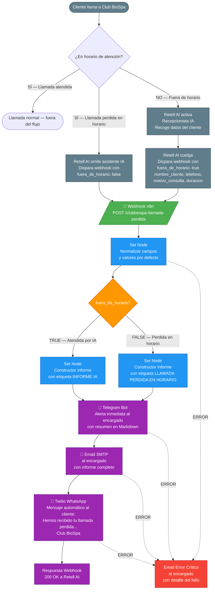

# Diagrama de Flujo — Club BioSpa Llamadas Perdidas

**Proyecto:** clubbiospa-llamadas-perdidas-2026-04  
**Versión:** 1.0  
**Fecha:** 2026-04-09  
**Stack:** n8n + Retell AI + Twilio WhatsApp + Telegram + SMTP

---

## Flujo Completo



---

## Descripción de Nodos

| # | Nodo | Tipo | Descripción |
|---|------|------|-------------|
| 1 | Webhook — Llamada Perdida | Trigger | Recibe POST de Retell AI al finalizar llamada |
| 2 | Set — Normalizar Datos | Set | Garantiza campos con valores por defecto |
| 3 | IF — ¿Fuera de Horario? | IF | Bifurca según campo `fuera_de_horario` del payload |
| 4 | Set — Informe Fuera de Horario | Set | Construye mensaje tipo "atendida por IA" |
| 5 | Set — Informe En Horario | Set | Construye mensaje tipo "perdida en horario laboral" |
| 6 | Telegram — Alerta Encargado | Telegram | Notificación inmediata por Telegram con Markdown |
| 7 | Email — Notificar Encargado | SMTP | Email con informe completo al encargado |
| 8 | Twilio — WhatsApp al Cliente | Twilio | Mensaje automático de confirmación al cliente |
| 9 | Respuesta Webhook — OK | Respond to Webhook | Devuelve 200 OK a Retell AI |
| 10 | Email — Error Crítico | SMTP | Rama de error: notifica cualquier fallo del flujo |

**Total nodos: 10** (bien por debajo del límite de 20)

---

## Contrato de Entrada — Payload de Retell AI

```json
{
  "nombre_cliente": "María García",
  "telefono": "+34612345678",
  "motivo_consulta": "Consulta sobre tratamiento facial y precios",
  "duracion_llamada": "94",
  "timestamp": "2026-04-09T18:32:00.000Z",
  "fuera_de_horario": true
}
```

Todos los campos son opcionales a nivel de validación (el nodo Set establece defaults), pero Retell AI debe enviar todos cuando sea posible.

---

## Casos de Uso Cubiertos

| Escenario | Comportamiento |
|-----------|---------------|
| Llamada perdida fuera de horario (Retell atendió) | Informe IA + Telegram + Email + WhatsApp cliente |
| Llamada perdida en horario laboral | Alerta directa + Telegram + Email + WhatsApp cliente |
| Payload incompleto (falta algún campo) | Set node pone defaults, flujo continúa sin errores |
| Fallo en cualquier nodo intermedio | Email de error crítico al encargado |
| Número de cliente inválido o sin WhatsApp | Fallo capturado por rama de error, notificación al encargado |

---

## Integración con PM Voz (Retell AI)

El PM Voz configura en Retell AI:

1. **Regla de horario:** Si la llamada entra fuera de horario → activar agente IA → al colgar, disparar este webhook con `fuera_de_horario: true`
2. **Regla en horario:** Si la llamada entra en horario y no se atiende → disparar este webhook con `fuera_de_horario: false`
3. **URL del webhook:** `{{ N8N_BASE_URL }}/webhook/clubbiospa-llamada-perdida`
4. **Método:** POST
5. **Headers:** `Content-Type: application/json`
