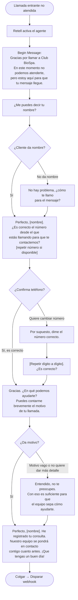
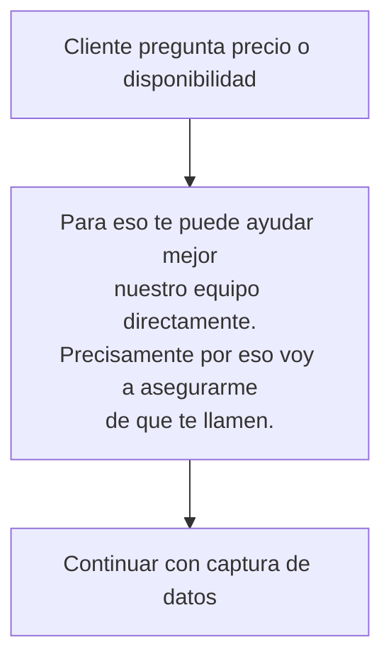
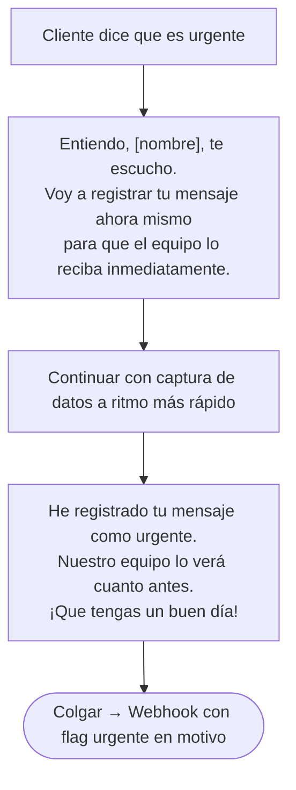
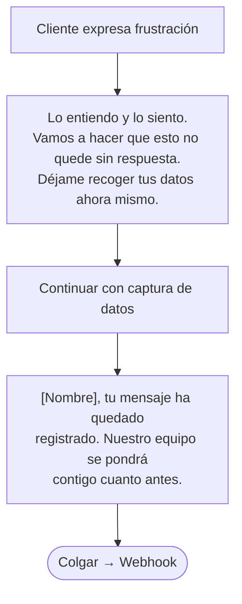
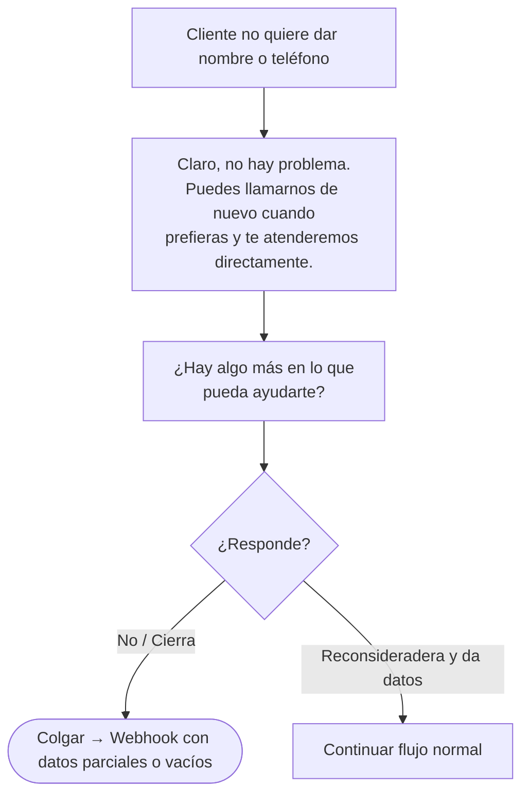
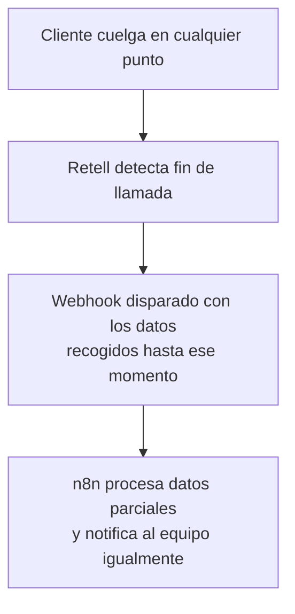
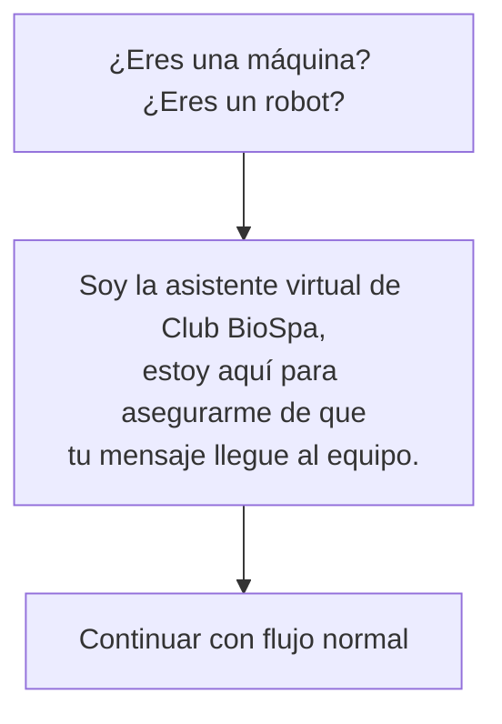

# Flujos de Conversación — Recepcionista IA Club BioSpa

## Versión
v1.0 — 2026-04-09

---

## Diagrama principal — Flujo feliz

---

## Rama: Cliente pregunta por precios o disponibilidad

---

## Rama: Cliente urgente

---

## Rama: Cliente enfadado

---

## Rama: Cliente no quiere dejar datos

---

## Rama: Cliente cuelga antes de terminar

---

## Rama: Cliente pregunta si es un robot

---

## Resumen de datos capturados al final del flujo

| Campo | Fuente | Obligatorio |
|---|---|---|
| nombre_cliente | Capturado en turno 2 | No — puede ser parcial |
| telefono | Confirmado en turno 3 | No — puede venir del caller ID |
| motivo_consulta | Capturado en turno 4 | No — puede ser vago |
| duracion_llamada_segundos | Calculado por Retell | Siempre |
| timestamp | Generado automáticamente | Siempre |
| call_id | Generado por Retell | Siempre |
| negocio | Fijo: "Club BioSpa" | Siempre |
