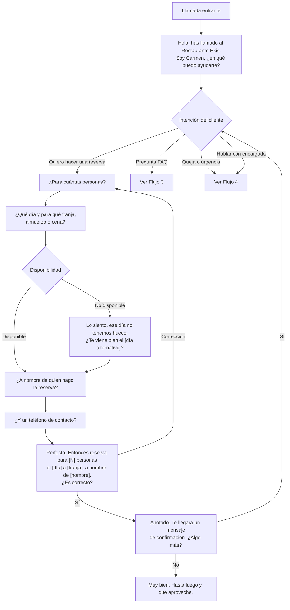
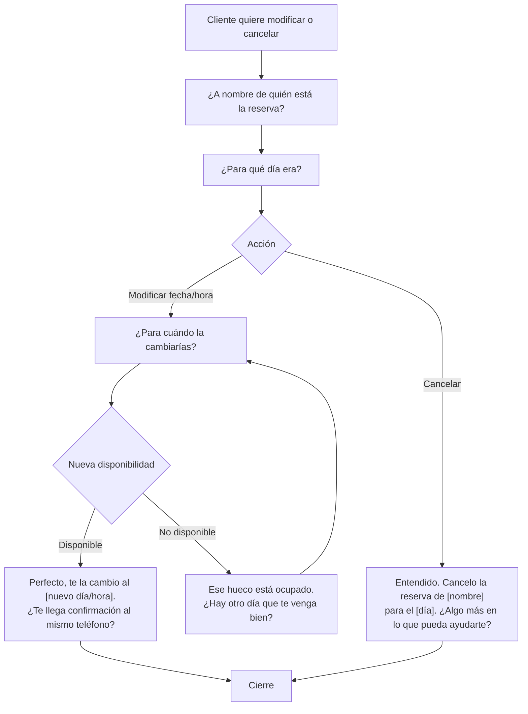
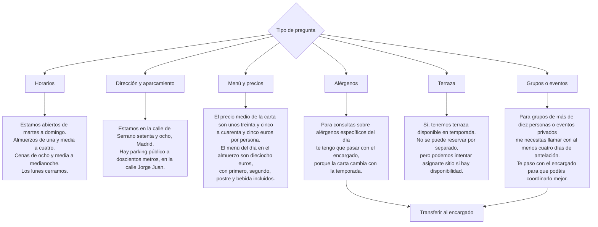
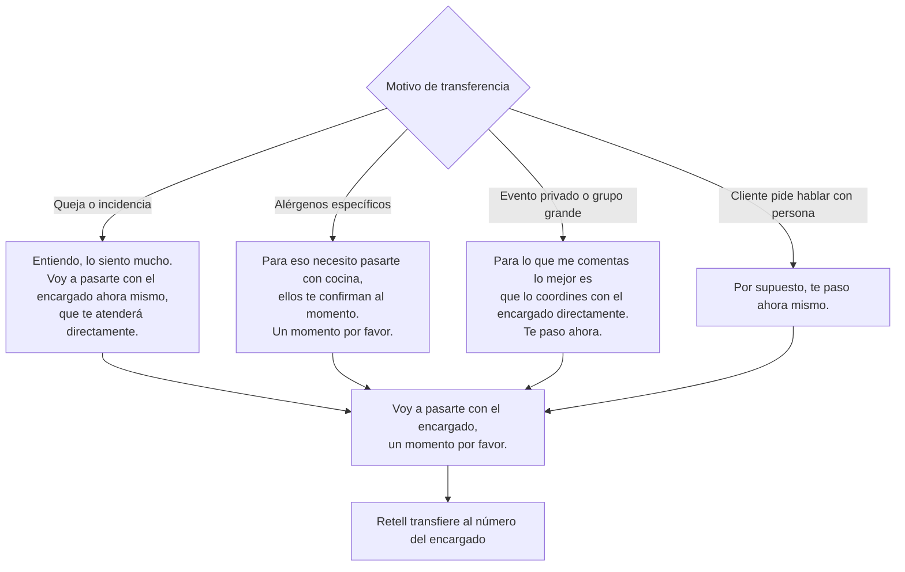

# Flujos de Conversación — Recepcionista Ekis

> Diagramas de los flujos principales. Usar como referencia para testing
> y para explicar el agente a futuros clientes restaurante.

---

## Flujo 1 — Reserva Estándar

---

## Flujo 2 — Modificar o Cancelar Reserva

---

## Flujo 3 — FAQs del Restaurante

---

## Flujo 4 — Transferencia a Humano

---

## Escenarios de Demo Recomendados

Para mostrar el agente a un restaurante potencial, hacer estas llamadas en este orden:

1. **Reserva perfecta** — "Quiero una mesa para dos el viernes por la noche"
2. **Reserva con modificación** — Reservar y luego llamar a cambiar la fecha
3. **FAQ horarios** — "¿A qué hora abren los domingos?"
4. **FAQ precio** — "¿Cuánto sale comer allí más o menos?"
5. **Cancelación** — "Tengo una reserva a nombre de López, necesito cancelarla"
6. **Cliente interrumpe** — Interrumpir al agente a mitad de frase para ver cómo reacciona
7. **Pregunta fuera de guión** — "¿Tenéis parking?" o "¿Hacéis domicilio?"
8. **Transferencia** — "Tengo una alergia grave al gluten, ¿qué podéis hacer?"
