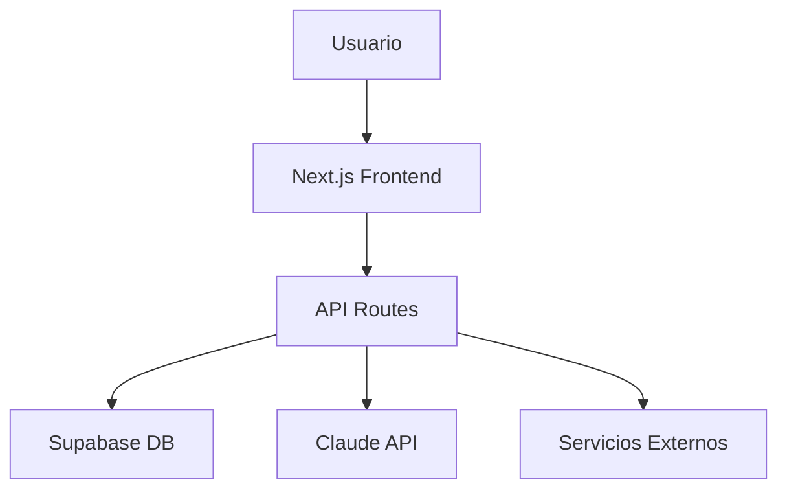

# SKILL: Documentation & Technical Writing

Basado en patrones de [alirezarezvani/claude-skills](https://github.com/alirezarezvani/claude-skills) y [subinium/awesome-claude-code](https://github.com/subinium/awesome-claude-code)

## Tipos de Documentación HAT3X

### 1. README.md — Proyecto

```markdown
# [Nombre del Proyecto]

> [Descripción de 1-2 frases. Qué hace y para quién.]

## Features

- [ ] Feature principal 1
- [ ] Feature principal 2
- [ ] Feature principal 3

## Stack Tecnológico

| Capa | Tecnología |
|------|------------|
| Frontend | Next.js 14, TypeScript, Tailwind CSS |
| Backend | Next.js API Routes |
| Database | Supabase (PostgreSQL) |
| Auth | NextAuth.js |
| IA | Claude API (Anthropic) |
| Deploy | Vercel |

## Quick Start

### Prerrequisitos

- Node.js 18+
- npm / pnpm
- [Servicio externo si aplica]

### Instalación

```bash
# 1. Clonar repositorio
git clone https://github.com/hat3x/[repo].git
cd [repo]

# 2. Instalar dependencias
npm install

# 3. Configurar variables de entorno
cp .env.example .env.local
# Editar .env.local con tus credenciales

# 4. Ejecutar en desarrollo
npm run dev
```

Visita http://localhost:3000

## Scripts Disponibles

```bash
npm run dev      # Desarrollo (localhost:3000)
npm run build    # Build producción
npm run start    # Start producción
npm run lint     # ESLint
npm run test     # Tests
```

## Variables de Entorno

| Variable | Descripción | Requerida |
|----------|-------------|-----------|
| `DATABASE_URL` | Connection string de Supabase | Sí |
| `ANTHROPIC_API_KEY` | API key de Claude | Sí |
| `NEXTAUTH_SECRET` | Secret para NextAuth | Sí |

Ver `.env.example` para todos los valores.

## Estructura del Proyecto

```
src/
├── app/              # App Router (páginas)
├── components/       # Componentes React
├── lib/              # Utilidades
└── types/            # TypeScript types
```

## Deploy

### Vercel

```bash
npm i -g vercel
vercel
```

### Variables en Vercel

Configurar en Project Settings → Environment Variables:
- `DATABASE_URL`
- `ANTHROPIC_API_KEY`
- `NEXTAUTH_SECRET`

## Contributing

1. Fork el repositorio
2. Crear feature branch (`git checkout -b feature/amazing-feature`)
3. Commit (`git commit -m 'feat: add amazing feature'`)
4. Push (`git push origin feature/amazing-feature`)
5. Open Pull Request

## License

MIT — ver [LICENSE](LICENSE)

## Contacto

Proyecto creado por HAT3X.
Soporte: soporte@hat3x.com
```

---

### 2. DOCUMENTATION.md — Documentación Técnica

```markdown
# Documentación Técnica — [PROYECTO]

## Arquitectura

### Diagrama de Alto Nivel



### Componentes Principales

#### Frontend

| Componente | Responsabilidad |
|------------|-----------------|
| `app/page.tsx` | Landing page |
| `app/dashboard/` | Dashboard protegido |
| `components/ui/` | Componentes shadcn |
| `components/shared/` | Componentes compartidos |

#### Backend

| Endpoint | Método | Descripción |
|----------|--------|-------------|
| `/api/chat` | POST | Enviar mensaje al chatbot |
| `/api/webhook` | POST | Webhook receptor |
| `/api/auth/*` | Varios | Autenticación |

#### Base de Datos

```sql
-- Tabla: users
CREATE TABLE users (
  id UUID PRIMARY KEY,
  email TEXT UNIQUE NOT NULL,
  name TEXT,
  created_at TIMESTAMPTZ DEFAULT NOW()
);

-- Tabla: conversations
CREATE TABLE conversations (
  id UUID PRIMARY KEY,
  user_id UUID REFERENCES users(id),
  messages JSONB,
  created_at TIMESTAMPTZ DEFAULT NOW()
);
```

## Decisiones de Diseño

### ADR-001: Elección de Next.js App Router

**Contexto:** Necesitábamos un framework React con SSR y routing moderno.

**Decisión:** Next.js 14 con App Router.

**Consecuencias:**
- ✅ Mejor performance con Server Components
- ✅ Mejor DX con colocation de datos
- ⚠️ Curva de aprendizaje para equipo

### ADR-002: Supabase como Database

**Contexto:** Necesitábamos PostgreSQL gestionado con auth incluida.

**Decisión:** Supabase sobre alternativas (PlanetScale, Neon).

**Consecuencias:**
- ✅ Auth integrado
- ✅ Realtime subscriptions
- ✅ Vector embeddings para RAG
```

---

### 3. MANTENIMIENTO.md — Troubleshooting

```markdown
# Guía de Mantenimiento — [PROYECTO]

## Problemas Comunes

### El build falla en Vercel

**Síntoma:** `Error: Command "npm run build" exited with 1`

**Causas posibles:**
1. Variables de entorno faltantes
2. Errores de TypeScript
3. Dependencias incompatibles

**Solución:**
```bash
# 1. Verificar variables en Vercel Dashboard
# 2. Correr build localmente
npm run build

# 3. Ver logs detallados
vercel logs
```

### Error de base de datos

**Síntoma:** `Error connecting to database`

**Causas posibles:**
1. DATABASE_URL incorrecta
2. SSL requerido pero no configurado
3. Pool agotado

**Solución:**
```bash
# Verificar connection string
echo $DATABASE_URL

# Probar conexión directa
psql $DATABASE_URL

# Verificar pool size en Supabase Dashboard
```

### API de Anthropic falla

**Síntoma:** `401 Unauthorized` o `429 Too Many Requests`

**Causas posibles:**
1. API key inválida o expirada
2. Rate limit excedido
3. Sin créditos en la cuenta

**Solución:**
```bash
# Verificar API key
curl -H "Authorization: Bearer $ANTHROPIC_API_KEY" \
  https://api.anthropic.com/v1/messages \
  -d '{"model":"claude-sonnet-4-6","max_tokens":10,"messages":[{"role":"user","content":"hi"}]}'

# Verificar usage en console.anthropic.com
```

### El chatbot no responde

**Síntoma:** Mensajes enviados pero sin respuesta

**Checklist:**
- [ ] Verificar logs de la API route
- [ ] Verificar conexión a Supabase
- [ ] Verificar API key de Anthropic
- [ ] Verificar webhooks configurados

---

## Monitoreo

### Health Check Endpoint

```typescript
// app/api/health/route.ts
export async function GET() {
  const checks = {
    database: await checkDatabase(),
    anthropic: await checkAnthropic(),
    uptime: process.uptime()
  }

  const allHealthy = Object.values(checks).every(c => c === 'ok')

  return Response.json({
    status: allHealthy ? 'healthy' : 'unhealthy',
    checks
  }, { status: allHealthy ? 200 : 503 })
}
```

### Métricas a Seguir

| Métrica | Alerta en | Dónde ver |
|---------|-----------|-----------|
| Error rate | > 1% | Vercel Analytics |
| Latencia p95 | > 500ms | Vercel Analytics |
| Uptime | < 99.9% | UptimeRobot |
| API calls/día | > 10,000 | Anthropic Console |

---

## Runbook de Incidentes

### Incidente: Sitio caído

1. Verificar status de Vercel: status.vercel.com
2. Ver logs: `vercel logs --follow`
3. Si es error de build: revert último deploy
4. Comunicar en Slack/Email al equipo

### Incidente: Datos corruptos

1. Identificar scope de corrupción
2. Restaurar desde backup (Supabase tiene daily backups)
3. Investigar causa raíz
4. Documentar en post-mortem

### Post-Mortem Template

```markdown
# Post-Mortem — [INCIDENTE]

**Fecha:** [FECHA]
**Duración:** [X horas/minutos]
**Impacto:** [qué usuarios/funcionalidades afectadas]

## Timeline

| Hora | Evento |
|------|--------|
| 10:00 | Inicio del incidente |
| 10:15 | Detectado por equipo |
| 10:30 | Mitigación aplicada |
| 11:00 | Resolución completa |

## Causa Raíz

[Descripción de qué causó el incidente]

## Acciones Correctivas

- [ ] [Acción 1] — Owner: [nombre] — Due: [fecha]
- [ ] [Acción 2] — Owner: [nombre] — Due: [fecha]

## Lecciones Aprendidas

- [Qué aprendimos]
- [Qué haremos diferente]
```
```

---

### 4. API.md — Documentación de API

```markdown
# API Reference — [PROYECTO]

## Autenticación

Todas las rutas protegidas requieren:
```
Authorization: Bearer <token>
```

## Endpoints

### POST /api/chat

Enviar mensaje al chatbot.

**Request:**
```json
{
  "sessionId": "abc123",
  "message": "¿Cuánto cuesta vuestro servicio?"
}
```

**Response 200:**
```json
{
  "data": {
    "response": "Nuestros servicios comienzan en 800€...",
    "sources": ["documento1.pdf", "faq.md"]
  }
}
```

**Response 422:**
```json
{
  "error": {
    "code": "VALIDATION_ERROR",
    "details": [
      { "field": "message", "message": "Requerido" }
    ]
  }
}
```

### GET /api/health

Health check del servicio.

**Response 200:**
```json
{
  "status": "healthy",
  "checks": {
    "database": "ok",
    "anthropic": "ok",
    "uptime": 86400
  }
}
```

## Rate Limits

| Endpoint | Limit |
|----------|-------|
| /api/chat | 100 req/min |
| /api/webhook | 1000 req/min |
| /api/health | Sin límite |

## Errores

| Code | Descripción |
|------|-------------|
| 400 | Bad Request — Input inválido |
| 401 | Unauthorized — Token inválido |
| 403 | Forbidden — Sin permisos |
| 404 | Not Found — Recurso no existe |
| 422 | Validation Error — Datos inválidos |
| 429 | Rate Limit — Demasiadas peticiones |
| 500 | Internal Error — Error del servidor |
```

---

## Checklist de Documentación

```markdown
## README.md
- [ ] Descripción clara del proyecto
- [ ] Features listados
- [ ] Stack tecnológico documentado
- [ ] Instrucciones de instalación
- [ ] Scripts disponibles
- [ ] Variables de entorno listadas
- [ ] Instrucciones de deploy
- [ ] Contacto/soporte

## DOCUMENTATION.md
- [ ] Diagrama de arquitectura
- [ ] Componentes principales documentados
- [ ] Schema de base de datos
- [ ] ADRs (Architecture Decision Records)

## MANTENIMIENTO.md
- [ ] Problemas comunes y soluciones
- [ ] Health check endpoint
- [ ] Métricas a seguir
- [ ] Runbook de incidentes
- [ ] Post-mortem template

## API.md
- [ ] Autenticación documentada
- [ ] Todos los endpoints listados
- [ ] Request/Response examples
- [ ] Rate limits documentados
- [ ] Errores posibles
```

---

## Reglas de Escritura Técnica

### Estilo

- **Voz activa:** "El sistema valida el input" no "El input es validado"
- **Presente:** "La función retorna" no "La función retornará"
- **Segunda persona para instrucciones:** "Edita el archivo" no "El archivo debe ser editado"

### Estructura

- Párrafos cortos (3-4 líneas máximo)
- Listas para items relacionados
- Código en bloques con lenguaje especificado
- Screenshots solo cuando añaden valor

### Traducciones

Si el proyecto es multi-idioma:
```
/docs/
├── en/
│   ├── README.md
│   └── API.md
└── es/
    ├── README.md
    └── API.md
```
